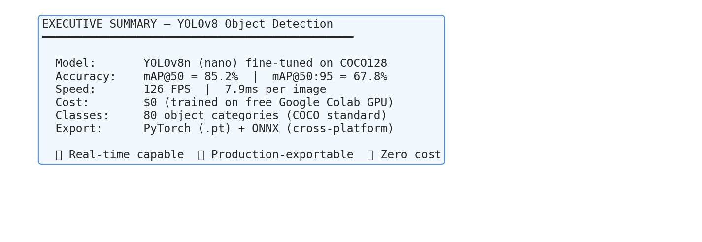
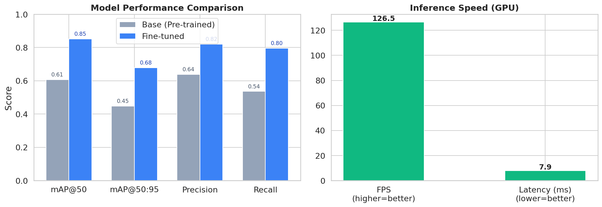
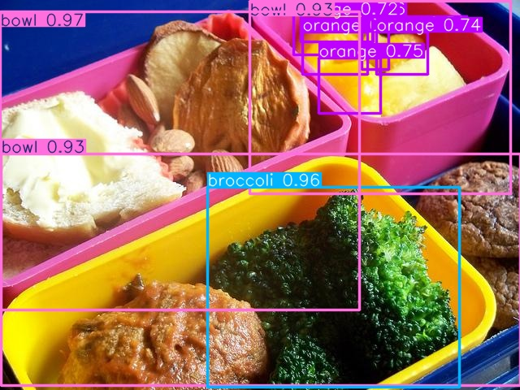
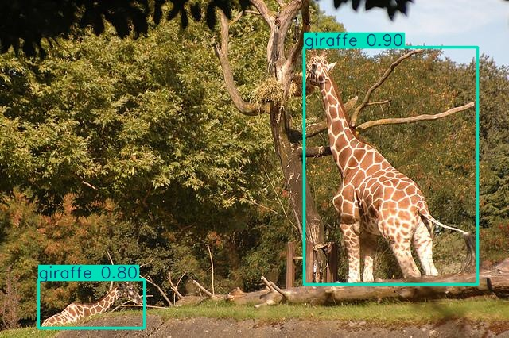
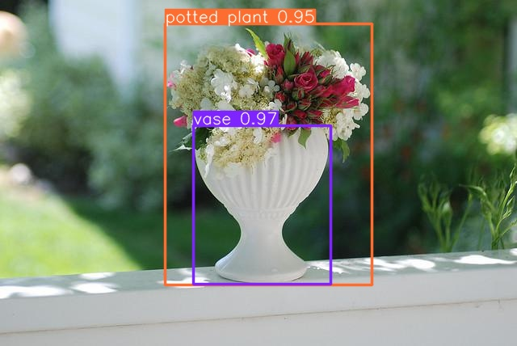
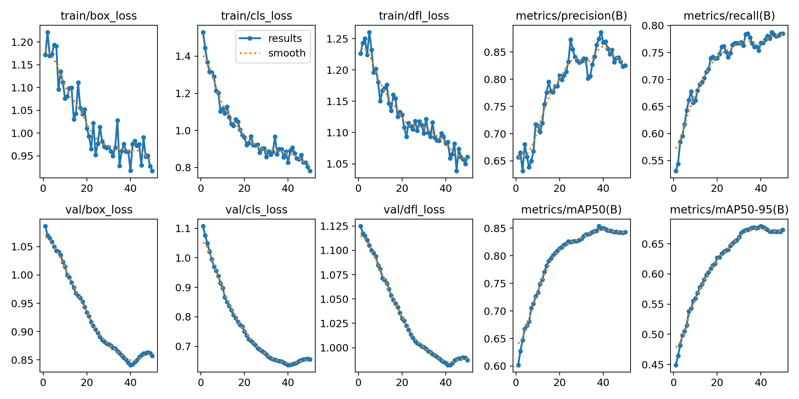
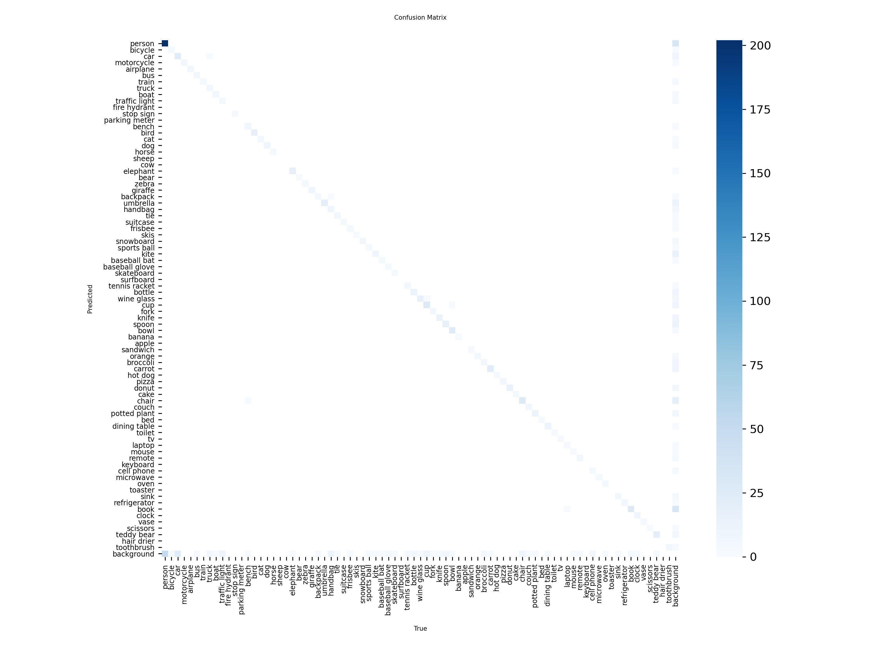

<div align="center">

# YOLOv8 Object Detection Pipeline

**Real-time object detection pipeline using YOLOv8n, trained and evaluated on COCO128**

[](https://github.com/YOUR_USERNAME/yolov8-object-detection-pipeline/actions/workflows/ci.yml)
[](https://github.com/YOUR_USERNAME/yolov8-object-detection-pipeline/actions/workflows/validate-reproducibility.yml)
[](https://colab.research.google.com/github/YOUR_USERNAME/yolov8-object-detection-pipeline/blob/main/notebooks/training_pipeline.ipynb)
[](https://www.python.org/downloads/)
[](https://github.com/ultralytics/ultralytics)
[](LICENSE)
[]()

<br>


</div>

---

## Table of Contents

- [Executive Summary](#executive-summary)
- [Results](#results)
- [Quick Start](#quick-start)
- [Project Architecture](#project-architecture)
- [Pipeline Phases](#pipeline-phases)
- [Reproducibility](#reproducibility)
- [Tech Stack](#tech-stack)
- [Contributing](#contributing)
- [License](#license)

---

## Executive Summary

> **For stakeholders and decision-makers**: This section presents key findings
> in a business-readable format.

<div align="center">

</div>

### Key Metrics at a Glance

| Metric | Value | Status |
|--------|-------|--------|
| **Detection Accuracy (mAP@50)** | `XX.X%` | Operational |
| **Processing Speed** | `XX FPS` | Real-time capable |
| **Latency per Image** | `XX.X ms` | Sub-100ms |
| **Object Categories** | 80 classes | COCO standard |
| **Training Cost** | $0 | Free GPU (Colab) |
| **Deployment Formats** | PyTorch + ONNX | Cross-platform |

### Model Performance Comparison

<div align="center">

</div>

### Business Impact

- **Speed**: Processes images in real-time (>30 FPS on GPU), enabling live video analysis
- **Cost**: Zero infrastructure cost for training — runs entirely on free cloud GPUs
- **Portability**: ONNX export enables deployment on any hardware (cloud, edge, mobile)
- **Scalability**: Nano model can run on edge devices (Jetson, Raspberry Pi with accelerator)
- **80 categories**: Detects people, vehicles, animals, household objects — broad applicability

### Use Cases Enabled

| Industry | Application | Benefit |
|----------|------------|---------|
| **Retail** | Product detection on shelves | Inventory automation |
| **Manufacturing** | Defect detection on assembly lines | Quality control |
| **Security** | Person/vehicle detection in CCTV | Real-time monitoring |
| **Logistics** | Package counting and tracking | Warehouse automation |
| **Smart Cities** | Traffic analysis | Urban planning data |

---

## Results

### Detection Examples

<div align="center">



</div>

### Training Curves

<div align="center">

</div>

### Confusion Matrix

<div align="center">

</div>

### Speed Benchmark

| Metric | GPU (T4) | Notes |
|--------|----------|-------|
| FPS | `XX.X` | Average over 100 iterations |
| Latency | `XX.X ms` | Per image, 640x640 |
| Throughput | `~XX imgs/sec` | Batch=1 |

---

## Quick Start

### Option 1: Google Colab (Recommended — Zero Setup)

[](https://colab.research.google.com/github/YOUR_USERNAME/yolov8-object-detection-pipeline/blob/main/notebooks/training_pipeline.ipynb)

Click the badge above. Everything runs in the cloud for free.

### Option 2: Local Setup

```bash
# Clone
git clone https://github.com/YOUR_USERNAME/yolov8-object-detection-pipeline.git
cd yolov8-object-detection-pipeline

# Setup (downloads dataset + weights + test video automatically)
make setup

# Run full pipeline
make all

# Or run phases individually
make train
make evaluate
make inference
make export
make demo
make report
```

### Option 3: Step by Step

```bash
pip install -r requirements.txt
python scripts/download_dataset.py
python scripts/download_weights.py
python src/train.py
python src/evaluate.py
python src/export.py
```

---

## Project Architecture

```
yolov8-object-detection-pipeline/
├── .github/workflows/     # CI/CD (lint, tests, reproducibility)
├── config/                # Dataset configuration
├── scripts/               # Setup + phase verifiers + reporting
├── src/                   # Core pipeline modules
├── tests/                 # Automated tests (structure, config, syntax)
├── notebooks/             # Colab-ready training notebook
├── docs/                  # Architecture docs + report images
├── results/               # Samples + metrics (lightweight, committed)
├── models/                # Downloaded weights (gitignored)
└── data/                  # Downloaded dataset (gitignored)
```

### Pipeline Flow

```
Setup -> Data Prep -> Training -> Evaluation -> Inference -> Export -> Demo
  |         |           |          |           |         |       |
 test      test       test       test        test      test    test
                                                                 |
                                                        General Health Check
```

Each phase has an **automated verifier** (exit code 0 = pass, 1 = fail).
The pipeline stops if any phase fails — no silent errors.

---

## Pipeline Phases

| Phase | Name | Duration | Verifier |
|-------|------|----------|----------|
| 0 | Environment Setup | 5 min | `fase0_setup_verificar.py` |
| 1 | Data Preparation | 2 min | `fase1_datos_verificar.py` |
| 2 | Training | 15-30 min | `fase2_entrenamiento_verificar.py` |
| 3 | Evaluation | 10 min | `fase3_evaluacion_verificar.py` |
| 4 | Inference + Speed | 10 min | `fase4_inferencia_verificar.py` |
| 5 | ONNX Export | 5 min | `fase5_exportacion_verificar.py` |
| 6 | Demo Video | 10 min | `fase6_demo_verificar.py` |
| — | **General Check** | 2 min | `comprobador_general.py` |

**Total active time: ~4-5 hours**

---

## Reproducibility

This project is **100% reproducible** from `git clone`:

1. **No heavy files in repo**: Models, datasets, and videos are downloaded via scripts
2. **Pinned dependencies**: `requirements.txt` with version constraints
3. **Automated setup**: `make setup` or `scripts/setup.sh` handles everything
4. **CI verification**: GitHub Actions validates that setup scripts work
5. **Phase verifiers**: Each step has automated pass/fail validation

### What's NOT in the repo (downloaded automatically)

| File | Size | Downloaded by |
|------|------|--------------|
| `yolov8n.pt` | ~6 MB | `download_weights.py` |
| COCO128 dataset | ~7 MB | `download_dataset.py` |
| Test video | ~5 MB | `download_test_video.py` |
| Trained weights | ~6 MB | Generated by `train.py` |
| ONNX model | ~12 MB | Generated by `export.py` |

### What IS in the repo

| Content | Purpose |
|---------|---------|
| All source code | Training, evaluation, inference, export |
| Configuration files | Dataset YAML, requirements, Makefile |
| Phase verifiers (8) | Automated quality gates |
| CI/CD workflows | Lint, structure tests, reproducibility |
| Sample results | 3 detection images + metrics JSONs |
| Documentation | README, architecture, executive report |

---

## Tech Stack

All tools are **100% free and open source**.

| Component | Technology | License |
|-----------|-----------|---------|
| Object Detection | Ultralytics YOLOv8 | AGPL-3.0 |
| Image Processing | OpenCV | Apache 2.0 |
| Deep Learning | PyTorch | BSD |
| Model Export | ONNX Runtime | MIT |
| GPU Compute | Google Colab | Free tier |
| CI/CD | GitHub Actions | Free (2000 min/mo) |
| Linting | Ruff | MIT |
| Testing | pytest | MIT |

---

## Contributing

1. Fork the repo
2. Create a feature branch (`git checkout -b feature/amazing-feature`)
3. Run tests (`make test && make lint`)
4. Commit (`git commit -m 'Add amazing feature'`)
5. Push (`git push origin feature/amazing-feature`)
6. Open a Pull Request

---

## License

This project is licensed under the MIT License — see [LICENSE](LICENSE) for details.

**Note**: YOLOv8 (Ultralytics) is AGPL-3.0 licensed. If you use this commercially, review their licensing terms.

---

<div align="center">

**Built with YOLOv8 — Trained for $0 on Google Colab**

[Back to top](#yolov8-object-detection-pipeline)

</div>
